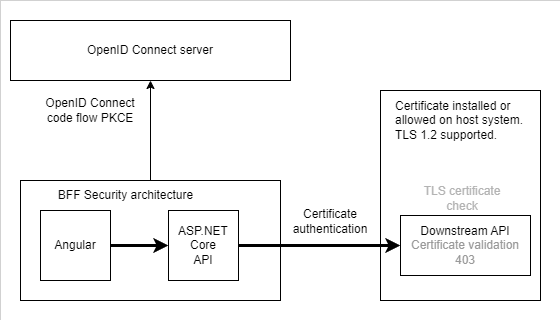

# BFF secured ASP.NET Core application using downstream API and certificate authentication

[ASP.NET Core and Angular BFF using a YARP downstream API protected using certificate authentication](https://damienbod.com/2024/11/04/asp-net-core-and-angular-bff-using-a-yarp-downstream-api-protected-using-certificate-authentication/)



## Debugging

Start the Angular project from the **ui** folder

```
ng serve --ssl
```

Start the ASP.NET Core projects from the **server** folder and the **identityProvider**

```
dotnet run
```

Or just open Visual Studio and run the solution.

## Credits and used libraries

- NetEscapades.AspNetCore.SecurityHeaders
- Yarp.ReverseProxy
- OpenIddict
- ASP.NET Core
- Angular
- OpenIddict

## History

- 2025-11-02 Updated packages, Angular 20.3.0
- 2025-08-03 Updated packages, Angular 20.1.4
- 2024-12-18 Bootstrap 5
- 2024-12-18 .NET 9, Angular 19, OpenIddict 6.0
- 2024-11-01 Small updates and fixes
- 2024-10-30 Fixed local certificate authentication
- 2024-10-27 Initial version

## Angular CLI Updates

```
npm install @angular/cli -g latest

npm install --force

npm run build
```

## Links

https://github.com/damienbod/bff-aspnetcore-angular

https://learn.microsoft.com/en-us/aspnet/core/introduction-to-aspnet-core

https://nx.dev/getting-started/intro

https://github.com/isolutionsag/aspnet-react-bff-proxy-example

https://github.com/openiddict

https://github.com/damienbod/bff-auth0-aspnetcore-angular

https://github.com/damienbod/bff-azureadb2c-aspnetcore-angular

https://github.com/damienbod/bff-aspnetcore-vuejs

https://github.com/damienbod/bff-MicrosoftEntraExternalID-aspnetcore-angular

https://microsoft.github.io/reverse-proxy/articles/transforms.html

https://github.com/microsoft/reverse-proxy/tree/main/samples/ReverseProxy.Transforms.Sample

https://dev.to/koheikawata/client-certifiate-authenticaiton-of-net-60-web-api-i9i#webserver-local